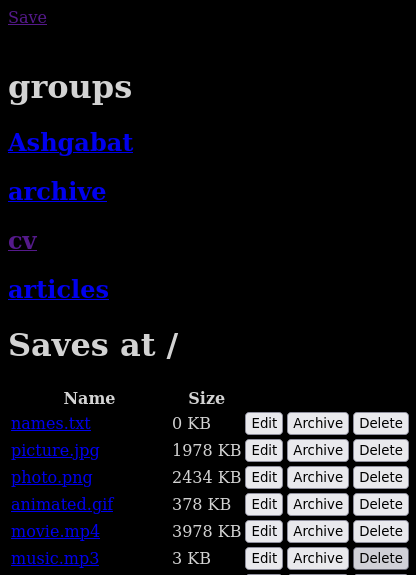
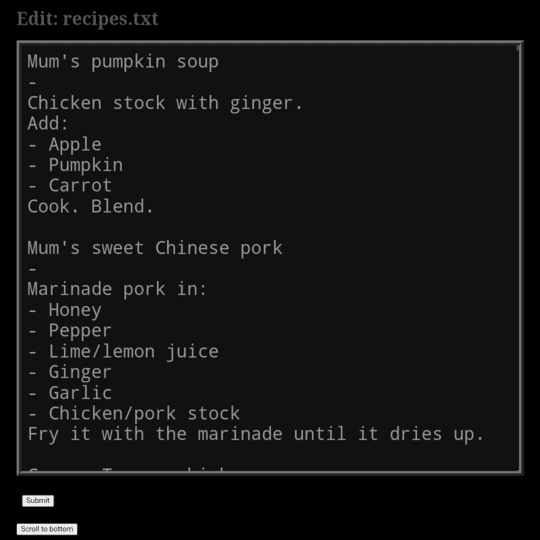

# save/load to S3 with jsaveload-s3
**jsaveload-s3** is a full stack Java Spring Boot web application designed to save and load files using an S3 bucket as a file store. It serves a few simple web pages as a frontend, and uploads and downloads files to and from S3 on the backend. I wrote this mainly to replace Evernote as my note-taking application, and to share files. I occasionally squeeze a new feature in now and then.

This application uses no JSP or 'templating', it just builds web pages with `StringBuilder`. With these no-frills pages, users can manage text notes and upload and share files, using only native browser features.

## Requirements

This is a Maven project that includes the AWS Java SDK version 2 as a dependency.

Downloading and viewing of files relies on the static website hosting feature for S3 buckets. Uploading, deleting and archiving do not require this feature to be enabled.

## Quick start

The application uses a top-level directory in your S3 bucket named `save`.

Private files can be kept in a directory with a name that starts with a UUID, e.g. `save/aaaaaaaa-bbbb-cccc-dddd-eeeeeeeeeeee-private`. These will be omitted from the top-level directory listing, but are otherwise unsecured.

Upload, delete and archive are authenticated by checking the value of the browser's `password` cookie against the `save.password` property. Note that storing passwords in plain text in the browser cookie store is not *generally* a good idea.

## API

The endpoints in the interface include:

- `GET /save` file upload interface
- `GET /saves/save/` the root directory listing 
- `GET /saves/save/{path}` subdirectory listings
- `GET /load` file download
- `GET /editText` edit text file in web page 
- `POST /save` file upload
- `POST /delete` delete file
- `POST /archive` move to `save/archive`
